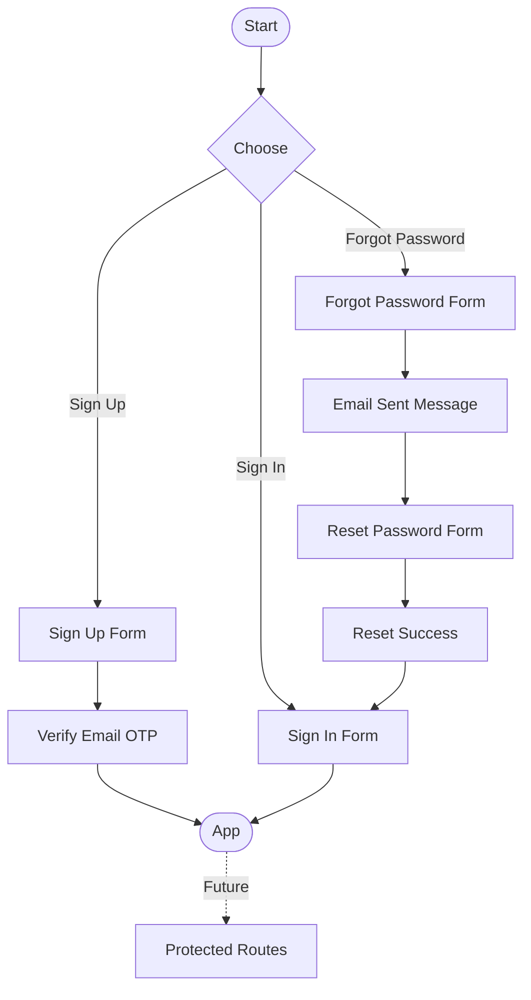

# Auth Feature Documentation

## Feature Status

| Layer    | Status |
| -------- | ------ |
| Frontend | ✅     |
| Backend  | ❌     |

---

## Overview

Complete authentication UI system with:

- Email/password registration with OTP verification
- Email/password login
- Password recovery flow
- Password visibility toggle
- Google OAuth button (UI only)

Built with Next.js (App Router), shadcn/ui, React Hook Form, and Zod validation.

---

## User Flows

### Sign Up Flow

```
Sign Up Form → Submit → Verify Email (OTP) → Sign In
```

### Sign In Flow

```
Sign In Form → Submit → App (not implemented)
```

### Forgot Password Flow

```
Forgot Password → Email Sent → Reset Password → Success → Sign In
```

---

## Pages / Routes

| Route              | Purpose                | View File                                          |
| ------------------ | ---------------------- | -------------------------------------------------- |
| `/sign-up`         | User registration      | `src/features/auth/views/signup-view.tsx`          |
| `/sign-in`         | User login             | `src/features/auth/views/signin-view.tsx`          |
| `/forgot-password` | Request password reset | `src/features/auth/views/forgot-password-view.tsx` |
| `/reset-password`  | Set new password       | `src/features/auth/views/reset-password-view.tsx`  |
| `/verify-email`    | OTP verification       | `src/features/auth/views/verify-email-view.tsx`    |

---

## Components & Architecture

### Feature Structure

```
src/features/auth/
├── components/          # Reusable UI components
├── views/              # Page-level compositions
├── validation/         # Zod schemas + inferred types
└── types/              # App-level interfaces
```

### Components

| Component       | File                                              | Purpose                               |
| --------------- | ------------------------------------------------- | ------------------------------------- |
| `AuthCard`      | `src/features/auth/components/auth-card.tsx`      | Card wrapper for auth forms           |
| `GoogleButton`  | `src/features/auth/components/google-button.tsx`  | OAuth login button (UI only)          |
| `FormField`     | `src/features/auth/components/form-field.tsx`     | Text input with RHF Controller        |
| `PasswordField` | `src/features/auth/components/password-field.tsx` | Password input with visibility toggle |
| `PasswordInput` | `src/features/auth/components/password-input.tsx` | Input with eye/eye-off toggle         |
| `OTPInput`      | `src/features/auth/components/otp-input.tsx`      | 6-digit OTP input component           |

### Architecture Pattern

- **Views**: Import components, handle state, compose page layout
- **Components**: Reusable, use RHF Controller for form integration
- **Page files**: Only import and render views (thin wrapper)

---

## Validation Rules

### Sign Up

| Field            | Rules                              |
| ---------------- | ---------------------------------- |
| Name             | Required                           |
| Email            | Valid email format                 |
| Password         | Min 8 chars, 1 uppercase, 1 number |
| Confirm Password | Must match password                |

### Sign In

| Field    | Rules              |
| -------- | ------------------ |
| Email    | Valid email format |
| Password | Required           |

### Reset Password

| Field            | Rules                              |
| ---------------- | ---------------------------------- |
| Password         | Min 8 chars, 1 uppercase, 1 number |
| Confirm Password | Must match password                |

### OTP Verification

| Field | Rules            |
| ----- | ---------------- |
| OTP   | Exactly 6 digits |

---

## UX & Behavior

### Form Patterns

- All forms use React Hook Form with Zod resolver
- Inline error messages via shadcn `FieldError`
- Submit buttons disabled during loading state
- `FormProvider` wraps all forms for context sharing

### Password Fields

- Toggle visibility with Eye/EyeOff icons
- Shared `PasswordInput` component ensures consistency
- State managed internally per field

### OTP Input

- 6 individual digit slots
- Numeric input only
- Auto-focus navigation between slots

---

## Current Limitations

- No backend integration (all actions log to console)
- Google OAuth is UI-only
- No route protection or auth guards
- No session management
- No email verification token handling
- Forgot password reset link flow not implemented (OTP not sent)

---

## Future Improvements

- [ ] Backend API integration
- [ ] Session/token management
- [ ] Route protection middleware
- [ ] Google OAuth implementation
- [ ] Email verification token flow
- [ ] Rate limiting on auth endpoints
- [ ] Remember me functionality
- [ ] Social login providers (GitHub, Apple)
- [ ] Two-factor authentication

---

## Flow Diagram



---

## Last Updated

Based on codebase analysis of `src/features/auth/`
